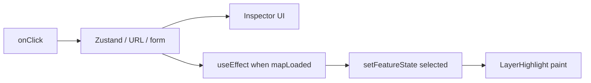

# Feature state (`setFeatureState`)

Use MapLibre **feature state** for **visual-only** flags on existing features (hover, selected, QA status colors). Keep **app truth** (inspector content, URL, forms) in React / Zustand / nuqs; push highlights to the map with `setFeatureState` or a React-driven layer `filter`.

Docs: [MapLibre `setFeatureState](https://maplibre.org/maplibre-gl-js/docs/API/classes/Map/#setfeaturestate)`·`[feature-state` expression](https://maplibre.org/maplibre-style-spec/expressions/#feature-state)

**One API, two argument shapes** — what you pass depends on whether the map handed you a feature or you only have ids from React/GeoJSON.

### A — Map gave you the feature

Pass the `**MapGeoJSONFeature`\*\* object. MapLibre already knows `source`, `sourceLayer`, and `id` on it.

**Where:** `onMouseMove` / `onClick` (via `event.features` + `interactiveLayerIds`); effects that call `queryRenderedFeatures` and then `mainMap.setFeatureState(feature, …)`.

**Map instance:** `**event.target`\*\* inside handlers.

```tsx
const handleMouseMove = ({ features, target }: MapLayerMouseEvent) => {
  const feature = features?.[0]
  if (!feature) return
  target.setFeatureState(feature, { hover: true })
}
```

In `**onClick**`, use `event.features[0]` the same way. Build shape B only when updating a feature **not** on the event (e.g. clear previous selection from form state).

### B — You only have ids from app data

Pass `**{ source, id, sourceLayer? }`\*\* yourself. Use when looping GeoJSON, reading form/URL ids, or resetting many features without a map query.

**Where (verified in tilda / Trassenscout):**

| Trigger                                                               | Handler           | Example                                                                                                                     |
| --------------------------------------------------------------------- | ----------------- | --------------------------------------------------------------------------------------------------------------------------- |
| User **just clicked** — reset many, then set selection                | `**onClick`\*\*   | Trassenscout `BaseMap` (clear all unified features, set slug group); `SwitchableMap` (clear previous id from form, set new) |
| React/URL changed **without** a map gesture — reset loop over GeoJSON | `**useEffect`\*\* | Trassenscout `SubsubsectionMap` (page slug); `AcquisitionAreaMap` (selection array)                                         |
| **Restore** highlight after remount from stored form/URL ids          | `**useEffect`\*\* | Trassenscout `SwitchableMap` (geometryCategorySourceId + featureId on load)                                                 |

**Not an Effect anti-pattern:** the map is an **external system** (MapLibre). Pushing React/Zustand/URL selection into `setFeatureState` is legitimate **external sync** — same category as `connectTo…` / `synchronizeWith…` in the `react-dev` skill. Prefer `**onClick`** when the user gesture already caused the change; use `**useEffect\*\*` when selection updates from store, URL, or mount while the map stays mounted.

**Map instance:** `**useMap()`** → `mainMap.getMap()` (see map-provider-wrapper.md). On vector/PMTiles include `**sourceLayer\*\*`; GeoJSON sources omit it.

```tsx
// useEffect — selection from URL/React, not from this frame's map event (SubsubsectionMap-style)
const { mainMap } = useMap()

useEffect(
  function synchronizeSelectionHighlightToMap() {
    if (!mainMap || !mapLoaded) return
    const map = mainMap.getMap()
    for (const f of geojson.features) {
      const id = f.properties?.featureId
      if (!id) continue
      map.setFeatureState({ source: sourceId, id }, { selected: id === selectedId })
    }
  },
  [mainMap, mapLoaded, geojson, selectedId],
)
```

## Two ways to highlight a feature

|                | **React-driven layer `filter`**                         | `**setFeatureState` + paint expression\*\*                          |
| -------------- | ------------------------------------------------------- | ------------------------------------------------------------------- |
| Map styling    | Fixed paint on a **second layer** (or the main layer)   | `**case` / `boolean` on `['feature-state', 'key']`** in **paint\*\* |
| What updates   | React re-render changes `filter` prop                   | Imperative `setFeatureState`                                        |
| Best for       | Selection tied to **React/URL list of ids**; small sets | **Hover**; many features; **status colors** from merged data        |
| Inspector data | Selection already in React — filter reads the same ids  | Click writes React; **effect** syncs map highlight (see below)      |

### React filter — `['in', 'id', …]`

Inspector selection lives in Zustand. A **highlight layer** filters to selected ids; no feature state:

```tsx
// tilda-geo: SourcesLayersOsmNotes.tsx
const selectedFeatureIds = inspectorFeatures
  .filter((f) => f.source === 'osm-notes-source')
  .map((f) => f.id as number)

<Layer
  id="osm-notes-layer-hover"
  source="osm-notes-source"
  type="circle"
  paint={{ 'circle-radius': 12, 'circle-color': '#f9a8d4' }}
  filter={
    selectedFeatureIds.length > 0
      ? ['in', 'id', ...selectedFeatureIds]
      : ['literal', false]
  }
/>
```

React owns the id list; the map just shows a pink circle for matching features.

### Feature state — paint `case`

Selection is toggled in React, **painted** via feature state:

```tsx
// trassenscout: AcquisitionAreaLayers.tsx
<Layer
  id="potential-areas-fill"
  type="fill"
  source="potential-areas-source"
  paint={{
    'fill-color': [
      // case: [condition, if-true, if-false]
      'case',
      // type-check: use value if boolean, else fallback (false)
      ['boolean', ['feature-state', 'selected'], false],
      '#2563eb', // selected
      '#94a3b8', // not selected
    ],
  }}
/>
```

```tsx
// Sync React selection → map (AcquisitionAreaMap.tsx)
map.setFeatureState({ source: 'potential-areas-source', id: area.id }, { selected: area.selected })
```

**When you also need hover:** change paint on the **same** layer for one key (`selected`) does not scale — you need **two keys** and often a **duplicate layer** so the base style stays untouched. Tilda **LayerHighlight** clones a layer and uses a **multi-branch** `case` (first true condition wins):

| vs OSM filter above                                                                          | vs acquisition fill above                                       |
| -------------------------------------------------------------------------------------------- | --------------------------------------------------------------- |
| Same duplicate-layer idea                                                                    | Same `setFeatureState` + paint `case`                           |
| Highlight from **feature state**, not React `filter` — needed for **hover** on `onMouseMove` | More than one key (`hover`, `selected`) and four paint outcomes |

```tsx
// tilda-geo: LayerHighlight.tsx — one paint property on the duplicate layer
;[
  'case',
  ['all', ['boolean', ['feature-state', 'hover'], false], ['boolean', ['feature-state', 'selected'], false]],
  '#a855f7', // hover + selected
  ['boolean', ['feature-state', 'hover'], false],
  '#eab308', // hover only
  ['boolean', ['feature-state', 'selected'], false],
  '#2563eb', // selected only
  '#94a3b8', // default
]
```

Hover is set in map handlers; selected is synced from React in an effect (same as acquisition).

## Reset first, then apply (diff pattern)

Feature state **accumulates** until cleared. Always **turn off** old features before turning on new ones.

### Diff only what changed (preferred — Tilda)

Track previous selection in a **ref**; on each run compare ref (previous) to current React selection:

```tsx
// tilda-geo: UpdateFeatureState.tsx
import { differenceBy } from 'es-toolkit/compat'
import { useEffect, useRef } from 'react'

const key = (f: MapGeoJSONFeature) => `${f.id}:::${f.layer.id}`

const previous = useRef<MapGeoJSONFeature[]>([])
const current = currentSelectedFeatures // from inspector / URL — MapGeoJSONFeature[]

useEffect(
  function syncSelectedFeatureStateToMap() {
    if (!mainMap || !mapLoaded) return

    differenceBy(previous.current, current, key).forEach((f) => {
      mainMap.setFeatureState(f, { selected: false })
    })
    differenceBy(current, previous.current, key).forEach((f) => {
      mainMap.setFeatureState(f, { selected: true })
    })

    previous.current = current // becomes "previous" on the next run
  },
  [current, mainMap, mapLoaded],
)
```

Hover uses the same diff on `onMouseMove` / `onMouseLeave` (`RegionMap.updateHover`).

### Reset all, then set (Trassenscout — multi-feature selection)

When one click selects **many related features**, reset-all + set happens in the **click handler** — same user gesture, no `useEffect`:

```tsx
// trassenscout: BaseMap.tsx — simplified
const handleClick = (event: MapLayerMouseEvent) => {
  const map = event.target
  const clicked = event.features?.[0]
  if (!clicked) return

  // 1. clear entire source
  geojson.features.forEach((f) => {
    map.setFeatureState({ source: 'features', id: f.properties.id }, { selected: false })
  })

  // 2. highlight every feature in the same group as the click
  const groupId = clicked.properties.groupId
  idsByGroup.get(groupId)?.forEach((id) => {
    map.setFeatureState({ source: 'features', id }, { selected: true })
  })
}

;<Map onClick={handleClick} interactiveLayerIds={['features-fill']} />
```

Contrast with **UpdateFeatureState** above: selection there changes from React/URL without a map click, so an effect diffs `previous.current` vs `current`.

### Clear previous on click (Trassenscout survey)

One click selects **one** feature. Read the previous id from **form state**, clear it, then set the new — all in the click handler:

```tsx
// trassenscout: SwitchableMap.tsx — simplified
const handleMapClick = (event: MapLayerMouseEvent) => {
  const feature = event.features?.[0]
  if (!feature || feature.id == null) return

  const previousId = form.getFieldValue('featureId')
  const previousSource = form.getFieldValue('sourceId')

  // 1. clear previous — only stored ids, not a feature object (see note below)
  if (previousId && previousSource && mainMap) {
    mainMap.getMap().setFeatureState({ source: previousSource, id: previousId }, { selected: false })
  }

  // 2. highlight clicked — pass feature; MapLibre gets sourceLayer from the event
  mainMap.setFeatureState(feature, { selected: true })

  // 3. persist for the next click
  form.setFieldValue('sourceId', feature.source)
  form.setFieldValue('featureId', feature.id)
}

;<Map onClick={handleMapClick} interactiveLayerIds={['areas-fill']} />
```

Contrast with **BaseMap** above: that resets **every** feature in the source; here you only clear the one id you stored last time.

**`sourceLayer` note:** step 2 is safe because `feature` from `event.features` already includes it. Step 1 builds `{ source, id }` from form fields — for **vector / PMTiles** you must also pass `sourceLayer` (Trassenscout uses `featureStateTargetForMapSource`); GeoJSON sources omit it. See shape B above.

## When React state and feature state both exist

**Pattern:** React (or URL) is the **source of truth for data**; feature state is **display sync**.



**Tilda inspector**

1. `onClick` → `replaceInspectorFeatures` + `setFeaturesParam` (Zustand + URL).
2. `<UpdateFeatureState />` child reads `useMapInspectorFeatures()` / URL-resolved features.
3. Effect runs `syncSelectedFeatureState` when selection changes (guarded by `useMapLoaded()`).

Inspector panels read **React features** (`MapGeoJSONFeature` properties), not feature state. Feature state only tints the map.

**Tilda QA — feature state replaces filter**

MapLibre **cannot** use `feature-state` in `**filter`\*\*. QA style toggles hide areas by zeroing paint via state, not by layer filter:

```tsx
// useQaMapState.ts — comment: client-side filtering since Maplibre doesn't support feature-state in filters
mainMap.setFeatureState(feature, {
  systemStatus: isVisible ? qaDataItem.systemStatus : null,
  userStatus: isVisible ? qaDataItem.userStatus : null,
})
```

Layer paint reads `['feature-state', 'userStatus']` / `systemStatus` (SourcesLayersQa.tsx). When QA tiles load, listen for source `data` and re-run sync (same hook).

**Trassenscout hover — global state alternative**

`useMapHighlight` sets **`map.setGlobalStateProperty('highlightSubsubsectionSlug', …)`** from `onMouseMove`; paint uses `['global-state', 'highlightSubsubsectionSlug']` in expressions (`UnifiedFeaturesLayer`). Same “paint expression” idea, different API — useful when hover spans many layers without per-feature ids.

## Where to call `setFeatureState`

| Trigger                       | Pattern                                                       | Example                                                     |
| ----------------------------- | ------------------------------------------------------------- | ----------------------------------------------------------- |
| Hover                         | `**onMouseMove` / `onMouseLeave**` — diff previous/current    | Tilda `RegionMap.updateHover`                               |
| Click selection (same turn)   | `**onClick**` — clear previous + set new                      | Trassenscout `BaseMap`, `SwitchableMap`                     |
| Selection from store / URL    | `**useEffect**` after `mapLoaded` — diff or reset+set         | Tilda `UpdateFeatureState`; Trassenscout `SubsubsectionMap` |
| External data merge (QA)      | `**useEffect**` + optional `map.on('data')` for source reload | Tilda `useQaMapState`                                       |
| React array toggles selection | `**useEffect**` on array, or `**onClick**` if local           | Trassenscout `AcquisitionAreaMap`                           |

Gesture-driven updates belong in **Map handlers** (map-event-handlers.md). Effects are for **React → map** sync only.

## Requirements

- `**feature.id`** must be set (integer or string). MapLibre drops non-integer ids on vector tiles unless the source uses `**promoteId\*\*`(Tilda atlas sources; Trassenscout`promoteId="featureId"` on GeoJSON).
- Pass a full `**MapGeoJSONFeature**` from `event.features` when possible — includes `source`, `sourceLayer`, `id`.
- Guard with `**useMapLoaded()**` before any `setFeatureState`.
- Skip when `**feature.id` is missing** or the **source is not on the map yet\*\* (layer listed in `interactiveLayerIds` before style applied — see interactive-layer-ids.md).
- **LayerHighlight** in Tilda waits for `mapLoaded` before mounting highlight layers.

## Limitations

| Limitation                                | Implication                                                                                                                                                                                                                   |
| ----------------------------------------- | ----------------------------------------------------------------------------------------------------------------------------------------------------------------------------------------------------------------------------- |
| `**feature-state` only in `paint**`       | Not in `layout`, `**filter**`, or most layout-driven props ([style spec](https://maplibre.org/maplibre-style-spec/expressions/#feature-state)). Use React `filter`, separate layers, or hide via paint (`opacity: 0`).        |
| **No geometry changes**                   | Cannot move/reshape features; use a separate layer or update source data.                                                                                                                                                     |
| **Per source (+ sourceLayer for vector)** | State is keyed by `{ source, sourceLayer?, id }`. Wrong target = silent no-op.                                                                                                                                                |
| **Cannot filter layers by feature state** | QA workaround: set state to `null` and branch in paint (Tilda). Do not expect `filter: ['==', ['feature-state', 'selected'], true]`.                                                                                          |
| **State survives until cleared**          | Must explicitly `{ selected: false }` / diff off old ids.                                                                                                                                                                     |
| **Viewport / query limits**               | Bulk updates via `queryRenderedFeatures` only see visible tiles; QA iterates rendered QA layer; full-source iteration may need data in memory (see [MapLibre #6213](https://github.com/maplibre/maplibre-gl-js/issues/6213)). |

## Choose an approach

```
Need inspector / URL / form to own feature data?
  yes → store MapGeoJSONFeature (or ids) in React
        → highlight: setFeatureState effect OR ['in','id',…] filter layer
        → UI reads React, not feature-state keys

Transient hover on many features?
  yes → setFeatureState in onMouseMove (diff hover true/false)
        OR global-state + paint expression (Trassenscout)

Hide features by app filter (QA style, category)?
  cannot use feature-state in filter
  → filter data in React and push into feature-state paint
  OR use layer filter on feature properties / separate source
```

## Related chapters

- [map-event-handlers.md](map-event-handlers.md) — hover/click handlers vs effects
- [map-loaded-hook.md](map-loaded-hook.md) — guard before `setFeatureState`
- [interactive-layer-ids.md](interactive-layer-ids.md) — features for click/hover targets
- [flat-source-layer.md](flat-source-layer.md) — highlight layers as siblings; shared layer ids
