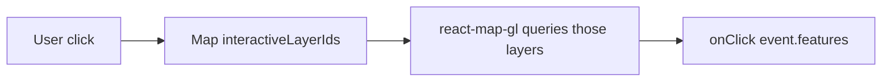

# interactiveLayerIds and event.features

In **react-map-gl**, pointer handlers on `<Map>` receive **`event.features`** already filtered to layers listed in **`interactiveLayerIds`**. This is different from raw MapLibre, where you typically call `queryRenderedFeatures(e.point, { layers: [...] })` yourself.

## Mental model



- **`interactiveLayerIds`**: string array of **MapLibre layer ids** (the `id` prop on `<Layer>`).
- **`onClick` / `onMouseMove` / `onMouseLeave`**: `features` is `MapGeoJSONFeature[] | undefined`, pre-filtered.
- Layers **not** in the list do not appear in `event.features` (as if they were not interactive).

## Tilda: building the list

Layer ids are derived from config + URL toggles, not hard-coded in `RegionMap`:

```tsx
// tilda-geo: RegionMap.tsx
const interactiveLayerIds = useInteractiveLayers()

<MapGl
  interactiveLayerIds={interactiveLayerIds}
  onClick={handleClick}
  onMouseMove={handleMouseMove}
  onMouseLeave={handleMouseLeave}
/>
```

`useInteractiveLayers` collects ids from active categories, notes, QA, datasets, and mask layers. Layers with `interactive: false` in config are excluded; mask layers are **manually** added because they use `inspector.enabled: false`.

## Tilda: click handler

One click can return the **same feature more than once** when several stacked layers in `interactiveLayerIds` all hit the same geometry (e.g. fill + outline, base + highlight). Dedupe before updating inspector / URL state:

```tsx
import { uniqBy } from 'es-toolkit/compat'

const handleClick = ({ features, ...event }: MapLayerMouseEvent) => {
  if (!features?.length) {
    clearInspectorFeatures()
    return
  }

  const uniqueFeatures = uniqBy(features, (f) => `${f.source}-${f.id}`)
  replaceInspectorFeatures(uniqueFeatures)
  // …persist to URL
}
```

## Tilda: hover + cursor

Same `features` array drives cursor and feature-state hover:

```tsx
const handleMouseMove = ({ features }: MapLayerMouseEvent) => {
  updateCursor(features)
  updateHover(features)
}
```

## Contrast with MapLibre core

| MapLibre (imperative)                                                        | react-map-gl (declarative)                                       |
| ---------------------------------------------------------------------------- | ---------------------------------------------------------------- |
| `map.on('click', (e) => { map.queryRenderedFeatures(e.point, { layers }) })` | `interactiveLayerIds={layers}` + `onClick={({ features }) => …}` |
| You choose layers per event                                                  | Layer set fixed on `<Map>` props                                 |
| Full map instance required                                                   | Handlers on `<Map>`; features delivered                          |

## Keep interactiveLayerIds in sync with rendered layers

`interactiveLayerIds` can be **one render ahead** of the style (layer id listed but not yet in style). Guard queries:

```tsx
// tilda-geo: useSelectedFeatures.ts
const styleLayerIds = new Set(mapInstance.getLayersOrder())
const layersToQuery = interactiveLayers.filter((id) => styleLayerIds.has(id))
const renderedFeatures = map.queryRenderedFeatures({ layers: layersToQuery })
```

Same guard applies if you manually call `queryRenderedFeatures` while syncing URL-selected features.

## Empty interactive set

Secondary maps that should not pick features:

```tsx
// tilda-geo: NotesNewMap.tsx
<MapGl interactiveLayerIds={[]} cursor="grab" onMove={handleMove} />
```

## Checklist

- [ ] Every pickable layer’s `id` is included in `interactiveLayerIds` when that layer should receive clicks/hover.
- [ ] Toggle visibility via config/URL updates **both** layer visibility and `interactiveLayerIds` (hidden layers should drop out of the list when they should not be clickable).
- [ ] Use `event.features` in handlers; avoid duplicate `queryRenderedFeatures` on click unless loading from URL.
- [ ] Features need stable `feature.id` (integer) for selection/hover state — MapLibre drops non-integer ids unless `promoteId` is set on the source.
