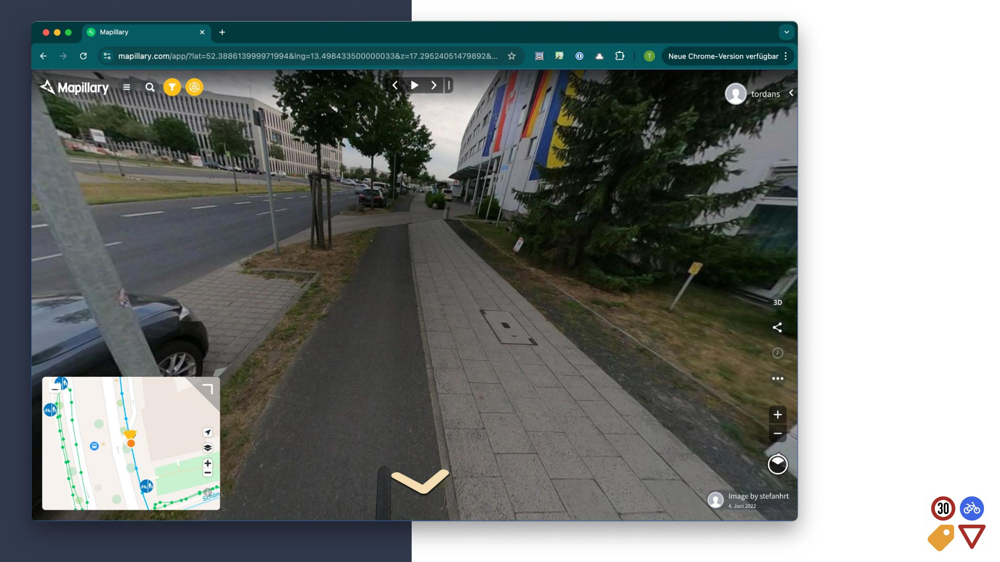
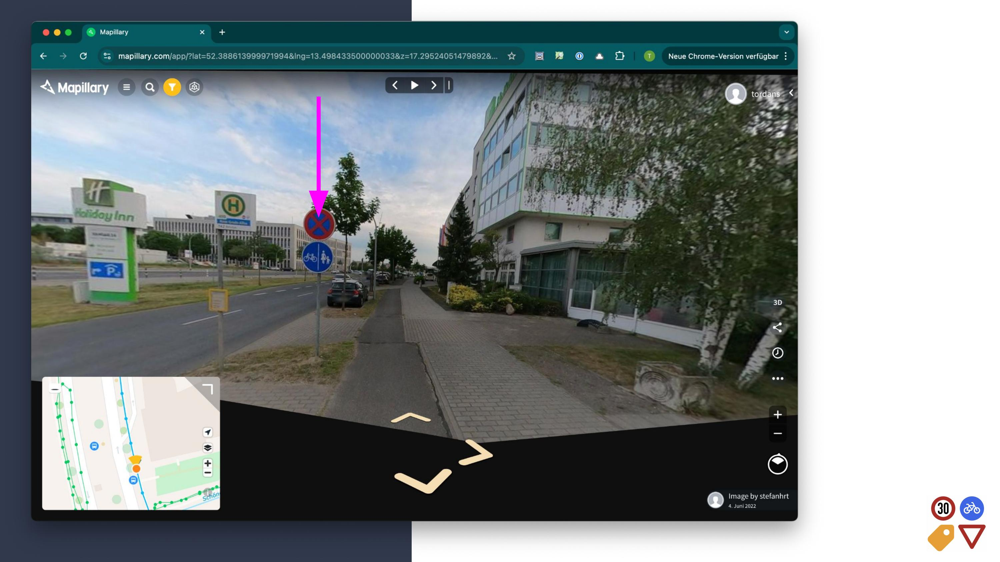
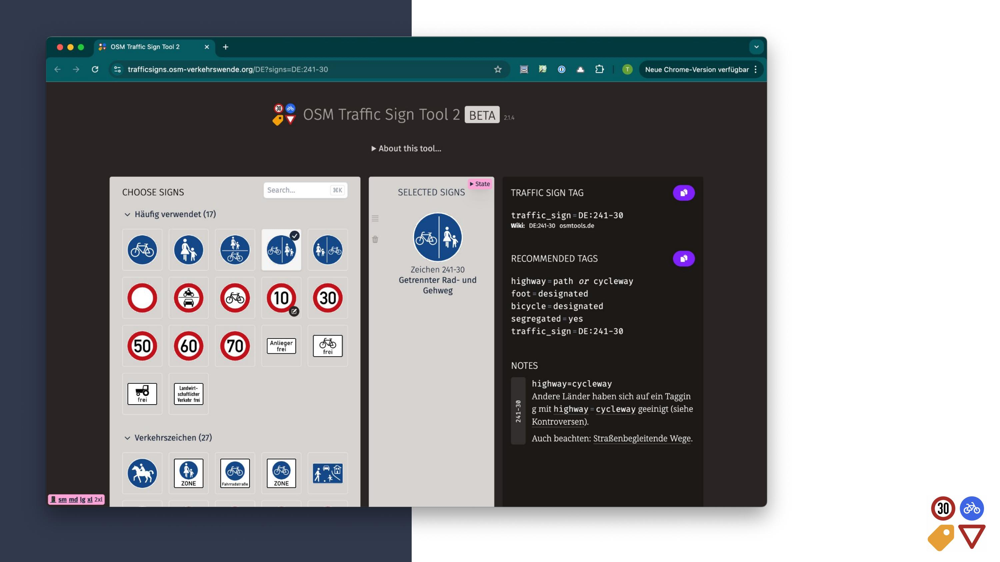
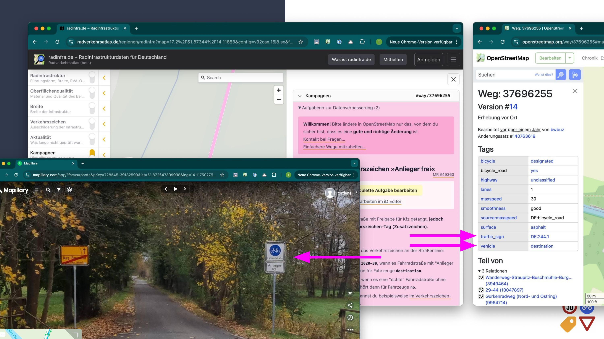
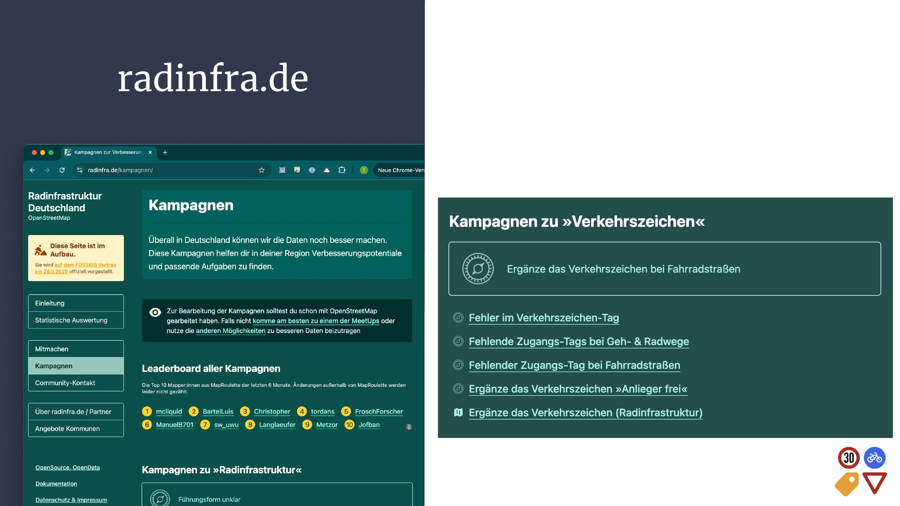
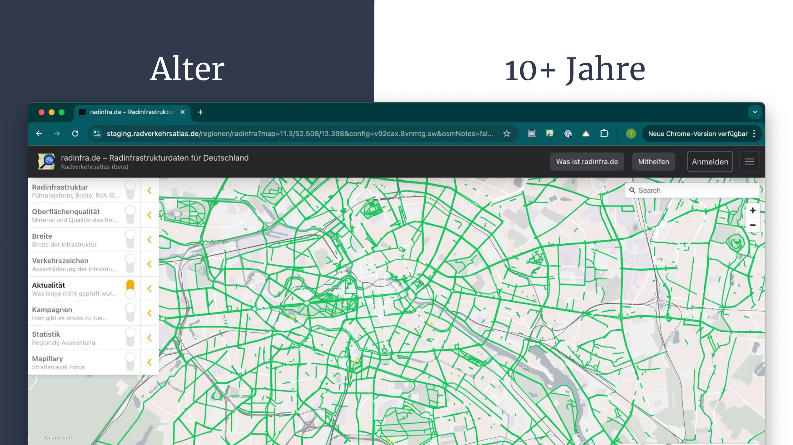
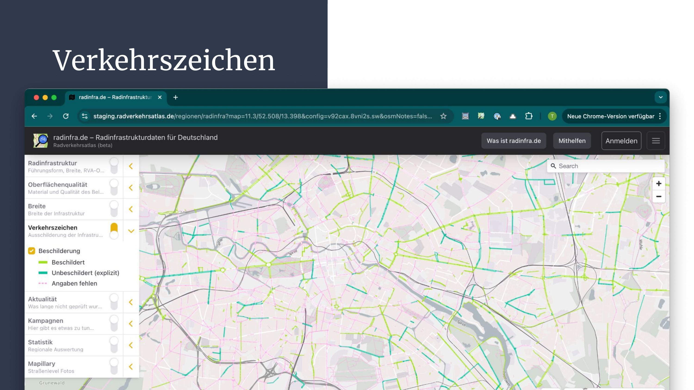
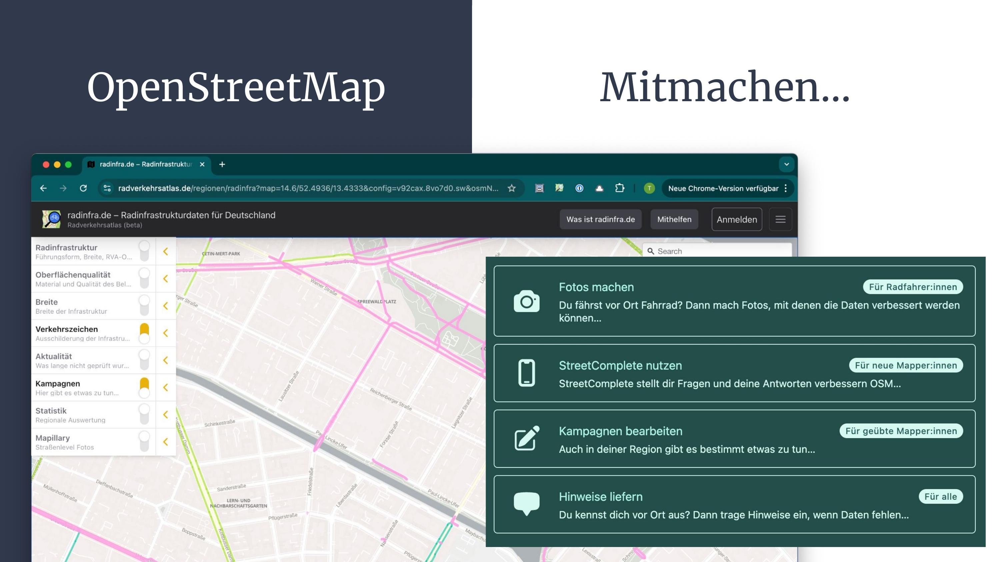

Diesen Vortrag habe ich am 3.3.2025 zum Demo Day, der Abschlussveranstaltung der 16. Prototype Fund Runde, gegeben. Er leitet die Motivation für das Projekt her und zeigt an Beispielen wichtige Teile des Projektes.

---

## Was ist OpenStreetMap?

Bevor wir in das Projekt einsteigen, werfen wir einen kurzen Blick auf OpenStreetMap.

OSM ist eine Datenbank für geografische Informationen, ähnlich wie Wikipedia – jeder kann Daten bearbeiten und sofort veröffentlichen. Die meisten Menschen interagieren jedoch nicht direkt mit OSM, sondern über Apps wie Komoot oder Karten auf Facebook sowie zahllose Karten von Mapbox oder Maptiler.

Technisch gesehen ist OSM eine offene Datenbank, die von vielen Firmen und Gruppen genutzt wird. Gleichzeitig ist OSM aber auch eine Community aus Mapper:innen, die Daten eintragen und ein weltweit einheitliches Schema entwickeln, um die komplexe Welt um uns herum in Geodaten abzubilden. Eine beeindruckende Leistung!

## Die Stärken von OpenStreetMap

OSM ist nicht nur sehr aktuell, sondern auch extrem detailliert. Besonders in Deutschland ist es oft aktueller und präziser als viele andere Datensätze.

Diese Qualität macht OSM für Verwaltungen und die Zivilgesellschaft attraktiv – beispielsweise bei der Planung von Radinfrastruktur. Häufig ist OSM bereits die bessere Datengrundlage, da bestehende Daten entweder ganz fehlen oder nach sehr unterschiedlichen Kriterien erhoben wurden.

Dennoch stellt sich die berechtigte Frage: **Wie hoch ist die Qualität der Daten in OSM?**

## Methoden zur Qualitätsbewertung

Es gibt verschiedene Ansätze, um die Qualität von OSM-Daten zu analysieren:

* **Alter der Daten**: Wann wurde ein Weg zuletzt geändert? Das funktioniert gut für sehr alte Daten.
* **Attribut-Dichte (Tags)**: Wie detailliert wurden Daten erfasst? Funktioniert mäßig, da Tagging-Schemata stark variieren.
* **Manuelle Prüfung**: Funktioniert gut, erfordert aber viel Aufwand.
* **Verkehrszeichen als Indikator nutzen**: Genau hier setzt unser Projekt an.

---

## Ein Beispiel aus der Praxis

Schauen wir uns ein konkretes Beispiel an:

Wie würdet ihr diese Infrastruktur in OSM erfassen?

Auf den ersten Blick scheint der Rad- und Fußverkehr getrennt zu sein, da es sich um einen Gehweg entlang einer Straße handelt.

Treten wir einen Schritt zurück, erkennen wir ein wichtiges Hilfsmittel: **das Verkehrszeichen!**

## Das Verkehrszeichentool

Mit diesem Wissen können wir nun unser **Verkehrszeichentool** nutzen:

[**Zum Tool**](https://trafficsigns.osm-verkehrswende.org/DE?signs=DE:241-30)

Hier erhalten wir **automatische Tagging-Empfehlungen**, die wir überprüfen und in OSM übernehmen können:

* Zugangstags für Rad- und Fußverkehr
* Angabe, dass Verkehrsformen getrennt sind
* Der spezifische Verkehrszeichen-Tag

Dieses Tool ist eines der zentralen Ergebnisse dieser **Prototype Fund Runde**. Es hilft, Verkehrszeichen in OSM korrekt zu erfassen und die Qualität der Daten zu verbessern.

---

## Verkehrszeichen für Qualitätssicherung nutzen

Verkehrszeichen ermöglichen nicht nur eine **detaillierte Kartierung**, sondern auch Analysen zur Qualitätssicherung.

Beispiel: Eine **Fahrradstraße mit "Anlieger frei"**

Das Tagging in OSM und das Verkehrszeichen passen nicht zusammen.

Mit **Mapillary** können wir das Verkehrszeichen überprüfen und die Daten in OSM korrigieren:

[**Mapillary Foto**](https://www.mapillary.com/app/?focus=photo\&pKey=728545139132599\&lat=51.872647399998\&lng=14.117502750275\&z=17\&x=0.49156747819464663\&y=0.5269046076938445\&zoom=0)\*\* | [OSM-Daten](https://www.openstreetmap.org/way/37696255#map=19/51.872696/14.119088\&layers=N) | [Verkehrszeichen-Tool](https://trafficsigns.osm-verkehrswende.org/DE?signs=DE:244.1,1020-30)\*\*

## Kampagnen für mehr Datenqualität

Um diese Kampagnen bekannter zu machen, haben wir uns mit [**radinfra.de**](http://radinfra.de/) vernetzt.

Dort findet ihr verschiedene **Kampagnen und Karten** zum Thema Verkehrszeichen:

👉 [**radinfra.de/kampagnen**](https://radinfra.de/kampagnen/)

## Bewertung der Datenqualität

Wie bewerten wir nun konkret die Qualität der Radinfrastruktur-Daten in Berlin?

* Eine Bewertung nach **Datenalter** liefert wenig neue Erkenntnisse – grüne Bereiche sind aktuell.\
  \
  [Ansicht im Radverkehrsatlas öffnen](https://tilda-geo.de/regionen/radinfra?map=12.5/52.481/13.428\&config=v92cax.8vnmtg.sw\&osmNotes=false\&v=2)
* Bei **Verkehrszeichen** sieht das anders aus!\
  \
  [Ansicht im Radverkehrsatlas öffnen](https://tilda-geo.de/regionen/radinfra?map=12.5/52.481/13.428\&config=v92cax.8vo7d0.sw\&osmNotes=false\&v=2) — Hier sehen wir…
  * **Beschilderte und explizit unbeschilderte Infrastruktur**
  * **Viele pinke Linien**

Die pinken Linien markieren Stellen, an denen die Qualität der OSM-Daten **gezielt verbessert** werden kann. Und genau darum geht es in unserem Projekt!

---

## Und jetzt?

Am Ende des **Prototype Funds** stehen wir eigentlich erst **am Anfang der Arbeit**:

Jetzt, wo die Verkehrszeichen-Daten gut gebündelt sind für die Nutzung in OpenStreetMap, gibt es gute Ideen zur Integration des Tools in andere OSM-Werkzeuge.

Diesen Bedarf sehen auch OSM-Aktive aus anderen Ländern, die planen das Tool für ihre lokalen Verkehrszeichen zu erweitern.

Und dann ist da das Mappen selbst: Viele, viele Wege in Deutschland sind jetzt sichtbar, die verbessert werden können.

Ich lade euch ein, euch **diese Woche etwas Zeit zu nehmen** und auf [**radinfra.de**](http://radinfra.de/) vorbeizuschauen. Dort findet ihr verschiedene Möglichkeiten, um zu OSM beizutragen – unter anderem unsere **Verkehrszeichen-Kampagnen**.

## Vielen Dank
